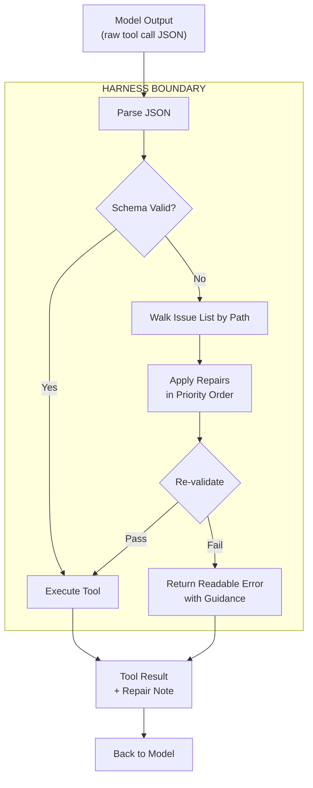

# Hermes Tool Repair Skill

[](LICENSE)

[](https://github.com/bojansandhaus/hermes-tool-repair-skill)

A **harness-level** fix for LLM tool calling. Catches the common JSON formatting mistakes open models make and fixes them deterministically before the tool executor ever sees them. The model benefits from repair notes in the tool result, but the actual repair happens in the harness layer. No model changes needed.

Based on the approach that made DeepSeek V4 Pro outperform Opus 4.7 on tool calling (see [CommandCode's post](https://x.com/CommandCodeAI/status/1927626163496718571) and [YouTube deep dive](https://www.youtube.com/watch?v=f61DCDwvFis)).

## The Problem

Open models (DeepSeek, GLM, Qwen, Kimi) make the same tiny JSON mistakes in tool calls over and over. Each mistake triggers a validation error. The model retries with the same bad format. The session degrades through 50+ wasted retry cycles. The model never learns because the error messages are opaque.

These mistakes are not random. They are a small finite set of patterns caused by the model's training distribution leaking through the tool boundary.

### Harness vs Model

Most people frame this as a model problem: "DeepSeek is bad at tool calling, wait for the next version." That is wrong. It is a **harness** problem. The harness sits between the model and the tool executor. It decides what to do with the model's output: reject it and waste tokens retrying, or fix it silently and move on. A harness that repairs deterministically turns a bad-at-tool-calling model into a functional one in about 200 lines of code.

The model did not change. The harness got more forgiving in exactly the places it needed to be.

## The Four Patterns This Fixes

| Pattern | What the model sends | What it should be |
|---------|---------------------|-------------------|
| Null omission | `{"cmd": "ls", "timeout": null}` | `{"cmd": "ls"}` |
| Stringified array | `{"files": "[\"a\",\"b\"]"}` | `{"files": ["a", "b"]}` |
| Empty object | `{"files": {}}` | `{"files": []}` |
| Bare string | `{"files": "main.ts"}` | `{"files": ["main.ts"]}` |
| Markdown autolink | `{"filePath": "/x/[f.md](http://f.md)"}` | `{"filePath": "/x/f.md"}` |

## How It Works



Everything inside the HARNESS BOUNDARY box is your agent framework. The model provides the raw JSON and receives the result. All repair logic, validation, and correction notes are handled at the harness layer.

**Key design rule:** Valid inputs are never touched. The repair layer parses the input as-is first. If it passes the schema, it ships immediately. Repairs only fire at paths the validator actually flagged. This prevents silent corruption of legitimate data (for example, writeFile content that happens to be JSON-shaped).

## Components

### `tool_repair.py` (the core library)

Standalone Python module with no dependencies beyond stdlib. Main entry point:

```python
from agent.tool_repair import repair_function_args

repaired_args, repair_notes = repair_function_args(
    function_name="readFile",
    function_args={"path": "/tmp/test.txt", "limit": None},
    tool_schema=None,  # optional JSON schema for type-aware repairs
)
# repaired_args = {"path": "/tmp/test.txt"}
# repair_notes = ["[repair: null values removed for optional fields]"]
```

Can be imported and used by any agent framework, not just Hermes.

### Hermes Agent integration (included)

Two small modifications to the Hermes harness core. Both operate at the harness layer, between the model's output and the tool executor:

1. **`agent/agent_runtime_helpers.py`**. `sanitize_tool_call_arguments()` is a harness function that walks tool calls before dispatch. It used to only catch unparseable JSON and replace it with `{}`. Now after `json.loads()` succeeds, it runs `repair_function_args()` on the parsed dict. If repairs trigger, it updates the arguments JSON and stores a repair note in the harness side-channel.

2. **`agent/tool_dispatch_helpers.py`**. `make_tool_result_message()` is a harness function that builds the tool result before it goes back to the model. It checks the harness side-channel for pending repair notes and appends them to the result content.

The model reads the repair note alongside the successful result and adapts on the next turn. The harness did the fixing. The model just benefits from seeing what was fixed.

### Hermes Plugin (draft)

`references/plugin.yaml` plus `plugin-architecture.md`. A blueprint for packaging the repair logic as a proper Hermes plugin with telemetry, dashboard, and config. Needs a `pre_tool_call` hook that supports argument modification (not currently available in Hermes hook system).

## Safety Guarantees

- **Valid inputs are never touched.** The first step is always "try the input as-is." Only paths that fail validation get repaired.
- **Non-JSON tool data is unaffected.** The repair layer only examines tool call arguments (the JSON dict describing what the tool should do), not tool results, binary content, images, or multimodal data.
- **Schema-aware array repairs.** Array-specific repairs (empty-object-to-array, bare-string-wrap) only fire when the tool JSON schema confirms the field expects an array type. Without a schema, only safe universal repairs run (null-strip, stringified-array-parse, autolink-unwrap).
- **Repair notes deduplicate.** If a repair note was already appended on a previous turn, it won't get stacked again.

## Dependencies

The core library (`tool_repair.py`) needs nothing beyond Python standard library. The Hermes integration needs Hermes Agent (any recent version) and is a three-file drop-in:

- `agent/tool_repair.py` (the repair library)
- Two lines added to `agent/agent_runtime_helpers.py`
- Two lines added to `agent/tool_dispatch_helpers.py`

No pip packages, no npm modules, no external services.

## How to Install

### Option 1: Minimal (just the library)

Drop `references/tool_repair.py` anywhere in your Python path:

```bash
cp references/tool_repair.py /your/project/tool_repair.py
```

Then import and use it directly:

```python
from tool_repair import repair_function_args
fixed, notes = repair_function_args("my_tool", {"some_field": None})
```

### Option 2: Hermes Agent integration

Copy the files and apply the two small patches described above:

```bash
# 1. Copy the library into Hermes agent directory
cp references/tool_repair.py /path/to/hermes/agent/tool_repair.py

# 2. The patches are detailed in the Components section above.
```

The integration automatically catches bad tool calls from any model. Enable or disable in your Hermes config:

```yaml
# ~/.hermes/config.yaml
agent:
  tool_repair: true  # default: true
```

### Option 3: Clone the repo

```bash
git clone https://github.com/bojansandhaus/hermes-tool-repair-skill.git
cd hermes-tool-repair-skill
cp references/tool_repair.py /wherever/you/need/it/
```

## Usage

### From any Python project

```python
import json
from tool_repair import repair_function_args

def dispatch_tool(name, args_json):
    args = json.loads(args_json)
    if isinstance(args, dict):
        fixed_args, notes = repair_function_args(name, args)
        if notes:
            print(f"Repaired {name}: {notes}")
            args_json = json.dumps(fixed_args)
    # proceed with the tool call
```

### In Hermes Agent

Already wired in. No additional setup needed. The integration lives in `sanitize_tool_call_arguments` and `make_tool_result_message`.

## Roadmap

- [x] Core repair library (5 pattern fixes)
- [x] Hermes integration (sanitize + tool result pipeline)
- [x] Repair note side channel (model self-correction)
- [ ] Schema-aware repairs (type inference from JSON schema)
- [ ] Per-model repair telemetry (dashboard tab)
- [ ] Model-specific repair profiles (DeepSeek, GLM, Kimi quirks)

## License

MIT. Free to use, modify, and distribute. This is a direct implementation of patterns discovered by the CommandCode team. Credit for the original insight goes to them.
