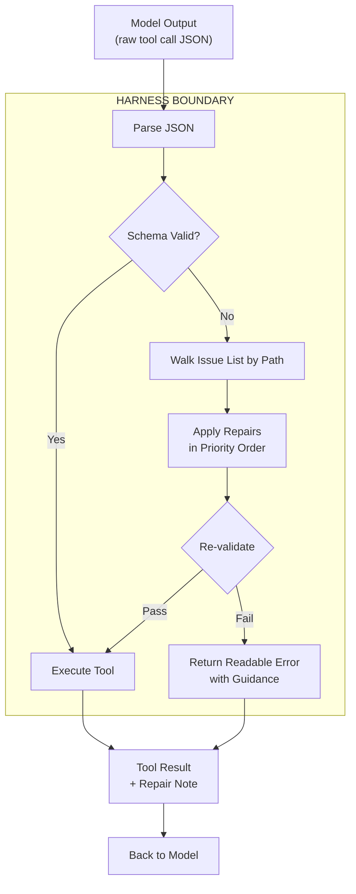

# Tool Repair Skill for Hermes and OpenCode

[](LICENSE)

[](https://github.com/bojansandhaus/tool-repair-skill-for-hermes-and-opencode)

A **harness-level** fix for LLM tool calling. Catches the common JSON
formatting mistakes open models make and fixes them deterministically before
the tool executor ever sees them. Ships with adapters for three agent
frameworks:

| Adapter | Language | Repair strategy |
|---------|----------|-----------------|
| **Hermes** (manual, two calls) | Python | Mutate args pre-dispatch + repair notes. Not wired in; you write the calls. |
| **OpenCode** (plugin) | TypeScript | `tool.execute.before` hook, mutates args directly |
| **Claude Code** (hooks) | Bash + jq | `PreToolUse` block so the model retries, `PostToolUse` telemetry. **Cannot mutate arguments**: PreToolUse can only allow or block, so this adapter corrects by feedback, not in place. |

Based on the approach that made DeepSeek V4 Pro outperform Opus 4.7 on tool
calling (see [CommandCode's write-up on tool call repairs](https://commandcode.ai/docs/harness-engineering/tool-call-repairs),
their [deep dive](https://commandcode.ai/blog/how-did-we-make-deepseek-outperform-claude-opus-4.7),
and this [video walkthrough](https://www.youtube.com/watch?v=f61DCDwvFis)).

## The Problem

Open models (DeepSeek, GLM, Qwen, Kimi) make the same tiny JSON mistakes in tool calls over and over. Each mistake triggers a validation error. The model retries with the same bad format. The session degrades through 50+ wasted retry cycles. The model never learns because the error messages are opaque.

These mistakes are not random. They are a small finite set of patterns caused by the model's training distribution leaking through the tool boundary.

### Harness vs Model

Most people frame this as a model problem: "DeepSeek is bad at tool calling, wait for the next version." That is wrong. It is a **harness** problem. The harness sits between the model and the tool executor. It decides what to do with the model's output: reject it and waste tokens retrying, or fix it silently and move on. A harness that repairs deterministically turns a bad-at-tool-calling model into a functional one in about 200 lines of code.

The model did not change. The harness got more forgiving in exactly the places it needed to be.

## The Repair Rules This Applies

| Pattern | What the model sends | What it should be |
|---------|---------------------|-------------------|
| Null omission | `{"cmd": "ls", "timeout": null}` | `{"cmd": "ls"}` |
| Null preserved | `{"name": null}` where `name` is `required` | unchanged, so the validator reports it |
| Stringified array | `{"files": "[\"a\",\"b\"]"}` | `{"files": ["a", "b"]}` |
| Empty object | `{"files": {}}` | `{"files": []}` |
| Bare string | `{"files": "main.ts"}` | `{"files": ["main.ts"]}` |
| Markdown autolink | `{"filePath": "/x/[f.md](http://f.md)"}` | `{"filePath": "/x/f.md"}` |

## How It Works


```mermaid
flowchart TD
    subgraph Harness["HARNESS BOUNDARY"]
        direction TB
        P["Parse JSON"] --> V{"Schema Valid?"}
        V -->|"Yes"| D["Execute Tool"]
        V -->|"No"| W["Walk Issue List by Path"]
        W --> R["Apply Repairs<br/>in Priority Order"]
        R --> RV{"Re-validate"}
        RV -->|"Pass"| D
        RV -->|"Fail"| E["Return Readable Error<br/>with Guidance"]
    end

    M["Model Output<br/>(raw tool call JSON)"] --> P
    D --> N["Tool Result<br/>+ Repair Note"]
    E --> N
    N --> B["Back to Model"]
```

Everything inside the HARNESS BOUNDARY box is your agent framework. The model provides the raw JSON and receives the result. All repair logic, validation, and correction notes are handled at the harness layer.

**Key design rule:** a repair only fires when it is unambiguously the right thing, so legitimate data survives. The rules that could touch arbitrary content are narrow on purpose. A string is only parsed as an array when it parses as one; an auto-link is only unwrapped when the link text equals the URL's own path component; an array-shaped repair only fires when the schema says the field is an array; a null is only dropped when the schema neither requires the field nor admits null for it. So `writeFile` content that happens to be JSON-shaped, a real `[click](https://example.com)` link, and bracketed prose like `[1, 2] and [3, 4]` all pass through untouched, and the test suite asserts each of those cases.

## Components

### `tool_repair.py` (the core library)

Standalone Python module with no dependencies beyond stdlib. Main entry point:

```python
from agent.tool_repair import repair_function_args

repaired_args, repair_notes = repair_function_args(
    function_name="readFile",
    function_args={"path": "/tmp/test.txt", "limit": None},
    tool_schema=None,  # optional JSON schema for type-aware repairs
)
# repaired_args = {"path": "/tmp/test.txt"}
# repair_notes = ["[repair: null values removed for optional fields]"]
```

Can be imported and used by any agent framework, not just Hermes.

### Hermes Agent integration (manual, two calls)

Wiring the repair layer into Hermes is a manual two-call integration that a
consumer writes in the harness itself. **Nothing in this repo ships that
integration and Hermes does not contain it.** Both calls operate at the harness
layer, between the model's output and the tool executor:

1. **`agent/agent_runtime_helpers.py`**. `sanitize_tool_call_arguments()` is a harness function that walks tool calls before dispatch. Call `repair_function_args()` on the parsed dict after `json.loads()` has already succeeded. If repairs trigger, write the fixed JSON back to the call's arguments.

2. **`agent/tool_dispatch_helpers.py`**. `make_tool_result_message()` is a harness function that builds the tool result before it goes back to the model. Call `deduplicate_repair_notes()` there to append the repair notes to the result content.

The model reads the repair note alongside the successful result and adapts on the next turn. The harness did the fixing. The model just benefits from seeing what was fixed.

### Hermes plugin manifest

`references/plugin.yaml` declares the hook surface (`transform_llm_output`) and `plugin-architecture.md` sketches the wiring. **This is not wired into Hermes yet.** Repairing an argument before dispatch needs a `pre_tool_call` hook that can modify arguments, which the Hermes hook system does not currently offer. Until it does, use the two-call integration above. There is no config key that turns this on: `agent.tool_repair` does not exist in Hermes, so setting it is a silent no-op.

## Adapted For Other Frameworks

This repo ships adapters for two other agent frameworks in the `adapters/`
directory. Each adapter wraps the same core `tool_repair.py` library with the
harness-specific wiring.

| Adapter | Location | Key mechanism |
|---------|----------|--------------|
| Hermes (manual) | `SKILL.md` | `sanitize_tool_call_arguments` pre-dispatch + repair notes. Not wired in. |
| OpenCode | `adapters/opencode/` | `tool.execute.before` TS plugin, mutates args directly |
| Claude Code | `adapters/claude-code/` | `PreToolUse` block + `PostToolUse` telemetry (bash + jq) |

OpenCode has the cleanest integration because its `tool.execute.before` hook
supports argument mutation. Claude Code is the most limited. `PreToolUse`
can only block, not mutate, so it wastes a turn when it detects a pattern.

See each adapter's README for setup instructions.

## Safety Guarantees

- **String-valued content is not at risk.** The stringified-array rule only fires on a string that parses as a JSON array, and the auto-link rule only fires when the link text equals the URL's own path component. Prose like `[1, 2] and [3, 4]` and a real link like `[click](https://example.com)` pass through untouched, which the test suite asserts.
- **Non-JSON tool data is unaffected.** The repair layer only examines tool call arguments (the JSON dict describing what the tool should do), not tool results, binary content, images, or multimodal data.
- **Schema-aware array repairs.** Array-specific repairs (empty-object-to-array, bare-string-wrap) only fire when the tool JSON schema confirms the field expects an array type. Without a schema, only safe universal repairs run (null-strip, stringified-array-parse, autolink-unwrap).
- **Repair notes deduplicate.** If a repair note was already appended on a previous turn, it won't get stacked again.

## Dependencies

The core library (`tool_repair.py`) needs nothing beyond Python standard library.

| Adapter | Dependencies |
|---------|-------------|
| Hermes | Hermes Agent (any recent version) |
| OpenCode | TypeScript, OpenCode CLI |
| Claude Code | bash, jq |

No pip packages, no npm modules, no external services for the core library.

## How to Install

### Core library (any framework)

```bash
cp references/tool_repair.py /your/project/tool_repair.py
```

```python
from tool_repair import repair_function_args
fixed, notes = repair_function_args("my_tool", {"some_field": None})
```

### Hermes Agent

Copy the library, then write the two calls described in Components yourself.
This repo ships no patch file and no installer for Hermes:

```bash
cp references/tool_repair.py /path/to/hermes/agent/tool_repair.py
```

Or prompt your agent:

> Clone `https://github.com/bojansandhaus/tool-repair-skill-for-hermes-and-opencode.git`, copy `references/tool_repair.py` into the Hermes agent directory, then call `repair_function_args` inside `sanitize_tool_call_arguments` after `json.loads()` succeeds and `deduplicate_repair_notes` in `make_tool_result_message`. There is no Hermes config key for this; it needs those two code changes.

### OpenCode

Copy the TypeScript adapter into your OpenCode plugins directory:

```bash
cp -r adapters/opencode/* ~/.config/opencode/plugins/
```

Or prompt your agent:

> Clone `https://github.com/bojansandhaus/tool-repair-skill-for-hermes-and-opencode.git` and copy the TypeScript plugin from `adapters/opencode/` to `~/.config/opencode/plugins/`.

### Claude Code

Copy the hook scripts and configure in `claude.json`:

```bash
cp adapters/claude-code/*.sh .claude/hooks/
chmod +x .claude/hooks/*.sh
```

Or prompt your agent:

> Clone `https://github.com/bojansandhaus/tool-repair-skill-for-hermes-and-opencode.git`, copy the hook scripts from `adapters/claude-code/` to `.claude/hooks/`, make them executable, and add the `pre_tool_use` and `post_tool_use` hook entries to `claude.json`.

```json
{
  "hooks": {
    "pre_tool_use": {
      "matcher": "*",
      "command": "bash .claude/hooks/pre_tool_use.sh"
    },
    "post_tool_use": {
      "matcher": "*",
      "command": "bash .claude/hooks/post_tool_use.sh"
    }
  }
}
```

### Clone the repo

```bash
git clone https://github.com/bojansandhaus/tool-repair-skill-for-hermes-and-opencode.git
cd tool-repair-skill-for-hermes-and-opencode
```

## Usage

### From any Python project

```python
import json
from tool_repair import repair_function_args

def dispatch_tool(name, args_json):
    args = json.loads(args_json)
    if isinstance(args, dict):
        fixed_args, notes = repair_function_args(name, args)
        if notes:
            print(f"Repaired {name}: {notes}")
            args_json = json.dumps(fixed_args)
    # proceed with the tool call
```

### In Hermes Agent

Not wired in. No setup step enables it: you make the two calls in Components by
hand, in `sanitize_tool_call_arguments` and `make_tool_result_message`.

## Roadmap

- [x] Core repair library (5 repair rules)
- [ ] Hermes integration (manual: two calls the consumer writes; not wired in)
- [x] OpenCode adapter (TypeScript plugin)
- [x] Claude Code adapter (bash + jq hooks)
- [x] Schema-aware repairs (array fields, and required/nullable null safety)
- [ ] Per-model repair telemetry (dashboard tab)
- [ ] Model-specific repair profiles (DeepSeek, GLM, Kimi quirks)

## License

MIT. Free to use, modify, and distribute. This is a direct implementation of patterns discovered by the CommandCode team. Credit for the original insight goes to them.
